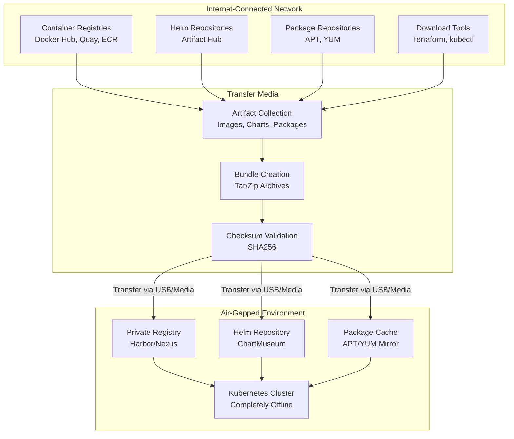

# Air-Gapped Deployment Guide

## Overview

This guide provides comprehensive instructions for deploying infrastructure in air-gapped (offline) environments with no direct internet access. It covers artifact management, image registry setup, network requirements, and offline deployment strategies.

## Architecture Overview



## Prerequisites

### Network Requirements

1. **Source Environment** (Internet-connected)
   - Unrestricted internet access
   - Docker/Podman installed
   - Helm CLI available
   - Package managers (apt, yum) accessible

2. **Air-Gapped Environment** (Offline)
   - No direct internet connectivity
   - Private container registry
   - Private Helm repository
   - Private package repository
   - USB drives or secure transfer media

3. **Transfer Methods**
   - USB storage devices (256GB+ recommended)
   - Dedicated transfer servers with air-gapped connectors
   - Secure copy via locked-down interfaces

### Required Tools (Source)

```bash
# Install tools on internet-connected machine
sudo apt-get install -y \
  docker.io \
  podman \
  skopeo \
  jq \
  curl \
  git

# Install Helm
curl https://raw.githubusercontent.com/helm/helm/main/scripts/get-helm-3 | bash

# Install Terraform
wget https://releases.hashicorp.com/terraform/1.6.0/terraform_1.6.0_linux_amd64.zip
unzip terraform_1.6.0_linux_amd64.zip
sudo mv terraform /usr/local/bin/

# Install kubectl
curl -LO "https://dl.k8s.io/release/$(curl -L -s https://dl.k8s.io/release/stable.txt)/bin/linux/amd64/kubectl"
sudo install -o root -g root -m 0755 kubectl /usr/local/bin/kubectl
```

## Step 1: Artifact Collection

### 1.1 Create Artifact Collection Script

```bash
#!/bin/bash
# collect-artifacts.sh - Collect all required artifacts

set -e

COLLECTION_DIR="/tmp/airgap-artifacts"
TIMESTAMP=$(date +%Y%m%d_%H%M%S)
LOG_FILE="$COLLECTION_DIR/collection-$TIMESTAMP.log"

mkdir -p "$COLLECTION_DIR"

echo "Starting artifact collection..." | tee "$LOG_FILE"

# Define versions and sources
KUBERNETES_VERSION="1.28.0"
HELM_VERSION="3.12.0"
INGRESS_CONTROLLER_VERSION="4.8.0"
KYVERNO_VERSION="1.10.0"
GATEKEEPER_VERSION="3.13.0"
POSTGRES_VERSION="14.8.0"

# Create directory structure
mkdir -p \
  "$COLLECTION_DIR/container-images" \
  "$COLLECTION_DIR/helm-charts" \
  "$COLLECTION_DIR/tools" \
  "$COLLECTION_DIR/packages"

echo "Artifact collection directory: $COLLECTION_DIR" | tee -a "$LOG_FILE"
```

### 1.2 Collect Container Images

```bash
#!/bin/bash
# collect-container-images.sh

IMAGES_DIR="$COLLECTION_DIR/container-images"
IMAGES_FILE="images-list.txt"

# Define all required images
cat > "$IMAGES_FILE" <<EOF
# Kubernetes core components
k8s.gcr.io/kube-apiserver:v1.28.0
k8s.gcr.io/kube-controller-manager:v1.28.0
k8s.gcr.io/kube-scheduler:v1.28.0
k8s.gcr.io/kube-proxy:v1.28.0
k8s.gcr.io/pause:3.9
k8s.gcr.io/coredns:v1.10.1

# NVIDIA GPU support
nvcr.io/nvidia/cuda:12.2.0-runtime-ubuntu22.04
nvcr.io/nvidia/k8s-device-plugin:v0.14.0

# Networking
docker.io/library/nginx:1.25
quay.io/kubernetes-ingress-controller/nginx-ingress-controller:v1.8.0

# Storage
docker.io/library/postgres:15

# Monitoring
docker.io/prom/prometheus:latest
docker.io/grafana/grafana:latest

# Security
ghcr.io/kyverno/kyverno:v1.10.0
openpolicyagent/gatekeeper:v3.13.0

# Utilities
docker.io/library/busybox:latest
docker.io/library/alpine:latest
EOF

echo "Collecting container images..."

# Pull and save images
while IFS= read -r image; do
  # Skip comments and empty lines
  [[ "$image" =~ ^#.*$ ]] && continue
  [[ -z "$image" ]] && continue
  
  echo "Pulling image: $image"
  
  # Create safe filename
  SAFE_NAME=$(echo "$image" | tr '/:' '_')
  ARCHIVE="$IMAGES_DIR/${SAFE_NAME}.tar"
  
  # Pull image
  docker pull "$image"
  
  # Save to tar
  docker save "$image" > "$ARCHIVE"
  
  # Compress
  gzip "$ARCHIVE"
  
  # Calculate checksum
  sha256sum "${ARCHIVE}.gz" > "${ARCHIVE}.gz.sha256"
  
  echo "✓ Saved: ${ARCHIVE}.gz"
  
 done < "$IMAGES_FILE"

echo "Image collection complete"
```

### 1.3 Collect Helm Charts

```bash
#!/bin/bash
# collect-helm-charts.sh

CHARTS_DIR="$COLLECTION_DIR/helm-charts"

# Add Helm repositories
helm repo add bitnami https://charts.bitnami.com/bitnami
helm repo add kyverno https://kyverno.github.io/kyverno/
helm repo add gatekeeper https://open-policy-agent.github.io/gatekeeper/charts
helm repo add ingress-nginx https://kubernetes.github.io/ingress-nginx
helm repo add prometheus-community https://prometheus-community.github.io/helm-charts
helm repo update

# Define charts to download
declare -A CHARTS=(
  ["bitnami/postgresql"]="14.8.0"
  ["kyverno/kyverno"]="1.10.0"
  ["gatekeeper/gatekeeper"]="3.13.0"
  ["ingress-nginx/ingress-nginx"]="4.8.0"
  ["prometheus-community/prometheus"]="25.0.0"
  ["prometheus-community/grafana"]="7.0.0"
)

echo "Collecting Helm charts..."

for chart in "${!CHARTS[@]}"; do
  version="${CHARTS[$chart]}"
  echo "Pulling chart: $chart:$version"
  
  # Create safe filename
  SAFE_NAME=$(echo "$chart" | tr '/' '_')
  
  # Pull chart
  helm pull "$chart" \
    --version "$version" \
    --destination "$CHARTS_DIR" \
    --untar
  
  # Create archive
  ARCHIVE="$CHARTS_DIR/${SAFE_NAME}-${version}.tar.gz"
  tar -czf "$ARCHIVE" -C "$CHARTS_DIR" "${SAFE_NAME}"
  
  # Calculate checksum
  sha256sum "$ARCHIVE" > "${ARCHIVE}.sha256"
  
  echo "✓ Saved: $ARCHIVE"
done

echo "Chart collection complete"
```

### 1.4 Collect Binary Tools

```bash
#!/bin/bash
# collect-tools.sh

TOOLS_DIR="$COLLECTION_DIR/tools"

echo "Collecting binary tools..."

# Download Kubernetes tools
echo "Downloading kubectl..."
curl -L "https://dl.k8s.io/release/v1.28.0/bin/linux/amd64/kubectl" \
  -o "$TOOLS_DIR/kubectl-v1.28.0"

# Download Helm
echo "Downloading Helm..."
curl -L "https://get.helm.sh/helm-v3.12.0-linux-amd64.tar.gz" \
  -o "$TOOLS_DIR/helm-v3.12.0.tar.gz"

# Download Terraform
echo "Downloading Terraform..."
curl -L "https://releases.hashicorp.com/terraform/1.6.0/terraform_1.6.0_linux_amd64.zip" \
  -o "$TOOLS_DIR/terraform-v1.6.0.zip"

# Calculate checksums
cd "$TOOLS_DIR"
sha256sum * > checksums.txt
cd - > /dev/null

echo "Tools collection complete"
```

## Step 2: Create Artifact Bundles

### 2.1 Create Master Artifact Bundle

```bash
#!/bin/bash
# create-bundle.sh - Create transferable artifact bundle

TIMESTAMP=$(date +%Y%m%d_%H%M%S)
BUNDLE_NAME="airgap-artifacts-$TIMESTAMP.tar"
BUNDLE_SIZE_LIMIT=$((256 * 1024 * 1024 * 1024))  # 256GB

echo "Creating artifact bundle..."

# Create manifest
cat > "$COLLECTION_DIR/MANIFEST.txt" <<EOF
# Air-Gapped Deployment Artifacts
# Generated: $TIMESTAMP
# Version: 1.0

## Contents
- Container Images: Docker images for all services
- Helm Charts: Helm charts for Kubernetes deployments
- Tools: Binary tools (kubectl, helm, terraform)
- Packages: System packages for offline installation
- Scripts: Deployment and configuration scripts

## Transfer Instructions
1. Copy bundle to USB drive: dd if=$BUNDLE_NAME of=/dev/sdX bs=4M
2. Verify checksums: sha256sum -c CHECKSUMS.txt
3. Copy to air-gapped environment
4. Extract: tar -xf $BUNDLE_NAME
5. Follow offline-deployment.sh

## Security
- All artifacts are checksummed
- Verify integrity before deployment
- Store securely during transfer
EOF

# Create checksums
echo "Creating checksums..."
cd "$COLLECTION_DIR"
sha256sum container-images/* helm-charts/* tools/* > CHECKSUMS.txt
cd - > /dev/null

# Create bundle
echo "Creating compressed archive..."
tar -cf "$BUNDLE_NAME" \
  -C "$(dirname "$COLLECTION_DIR")" \
  "$(basename "$COLLECTION_DIR")"

# Verify bundle
ACTUAL_SIZE=$(ls -lh "$BUNDLE_NAME" | awk '{print $5}')
echo "Bundle created: $BUNDLE_NAME (Size: $ACTUAL_SIZE)"

# Split if too large
if [ $(stat -f%z "$BUNDLE_NAME") -gt $BUNDLE_SIZE_LIMIT ]; then
  echo "Bundle too large, splitting..."
  split -b 100GB "$BUNDLE_NAME" "${BUNDLE_NAME}.part"
  rm "$BUNDLE_NAME"
fi
```

### 2.2 Verify Bundle Integrity

```bash
#!/bin/bash
# verify-bundle.sh

BUNDLE_NAME="$1"

if [ -z "$BUNDLE_NAME" ]; then
  echo "Usage: verify-bundle.sh <bundle-name>"
  exit 1
fi

echo "Verifying bundle integrity..."

# Check if bundle exists
if [ ! -f "$BUNDLE_NAME" ]; then
  echo "✗ Bundle not found: $BUNDLE_NAME"
  exit 1
fi

# Verify file size
SIZE=$(ls -lh "$BUNDLE_NAME" | awk '{print $5}')
echo "✓ Bundle size: $SIZE"

# Extract and verify
echo "Extracting and verifying checksums..."
tar -tf "$BUNDLE_NAME" | wc -l | xargs echo "  Files in bundle:"

# Verify checksums if extracted
if [ -f "CHECKSUMS.txt" ]; then
  echo "Verifying file checksums..."
  sha256sum -c CHECKSUMS.txt
  if [ $? -eq 0 ]; then
    echo "✓ All checksums verified"
  else
    echo "✗ Checksum verification failed"
    exit 1
  fi
fi

echo "✓ Bundle verification complete"
```

## Step 3: Setup Private Registry

### 3.1 Deploy Harbor Registry

```bash
#!/bin/bash
# deploy-harbor.sh - Deploy Harbor private registry

HARBOR_VERSION="2.9.0"
HARBOR_HOSTNAME="registry.local"
HARBOR_DATA_DIR="/var/lib/harbor"

# Create directories
mkdir -p "$HARBOR_DATA_DIR"
chmod 700 "$HARBOR_DATA_DIR"

# Download Harbor installer
echo "Downloading Harbor..."
curl -L "https://github.com/goharbor/harbor/releases/download/v${HARBOR_VERSION}/harbor-offline-installer-v${HARBOR_VERSION}.tgz" \
  -o harbor-installer.tar.gz

# Extract
tar -xzf harbor-installer.tar.gz
cd harbor

# Configure Harbor
cat > harbor.yml <<EOF
hostname: $HARBOR_HOSTNAME
http:
  port: 80
https:
  port: 443
  certificate: /etc/ssl/certs/server.crt
  private_key: /etc/ssl/private/server.key
harbor_admin_password: "$(openssl rand -base64 16)"
data_volume: $HARBOR_DATA_DIR
log:
  level: info
database:
  password: "$(openssl rand -base64 16)"
redis:
  password: "$(openssl rand -base64 16)"
EOF

# Install
./prepare
docker-compose up -d

# Verify
sleep 10
curl -k https://$HARBOR_HOSTNAME/v2/

echo "✓ Harbor installed at https://$HARBOR_HOSTNAME"
```

### 3.2 Load Images into Registry

```bash
#!/bin/bash
# load-images.sh - Load collected images into private registry

REGISTRY_URL="registry.local:5000"
REGISTRY_USER="admin"
REGISTRY_PASSWORD="<password>"
IMAGES_DIR="./container-images"

echo "Loading images into private registry..."

# Login to registry
echo "$REGISTRY_PASSWORD" | docker login \
  -u "$REGISTRY_USER" \
  --password-stdin "$REGISTRY_URL"

# Load each image
for archive in "$IMAGES_DIR"/*.tar.gz; do
  if [ -f "$archive" ]; then
    echo "Loading image: $archive"
    
    # Load image from archive
    docker load -i "$archive"
    
    # Get image name
    IMAGE=$(docker load -i "$archive" 2>&1 | grep -oP 'Loaded image: \K.*')
    
    # Tag and push to private registry
    if [ -n "$IMAGE" ]; then
      # Extract registry/name/tag
      REGISTRY=$(echo "$IMAGE" | cut -d'/' -f1)
      REMAINING=$(echo "$IMAGE" | cut -d'/' -f2-)
      
      # Create local tag
      LOCAL_TAG="$REGISTRY_URL/$REMAINING"
      
      docker tag "$IMAGE" "$LOCAL_TAG"
      docker push "$LOCAL_TAG"
      
      echo "✓ Pushed: $LOCAL_TAG"
    fi
  fi
done

echo "✓ Image loading complete"
```

## Step 4: Setup Private Helm Repository

### 4.1 Deploy ChartMuseum

```bash
#!/bin/bash
# deploy-chartmuseum.sh - Deploy ChartMuseum for Helm charts

CHARTMUSEUM_VERSION="0.15.0"
CHARTMUSEUM_PORT="8080"
CHARTMUSEUM_DATA="/var/lib/chartmuseum"

mkdir -p "$CHARTMUSEUM_DATA"

# Run ChartMuseum in Docker
docker run -d \
  --name chartmuseum \
  -p "$CHARTMUSEUM_PORT:8080" \
  -v "$CHARTMUSEUM_DATA:/data" \
  -e STORAGE=local \
  -e STORAGE_LOCAL_ROOTDIR=/data \
  ghcr.io/helm/chartmuseum:v"$CHARTMUSEUM_VERSION"

echo "✓ ChartMuseum running on port $CHARTMUSEUM_PORT"
```

### 4.2 Upload Charts to Repository

```bash
#!/bin/bash
# upload-charts.sh - Upload Helm charts to ChartMuseum

CHARTMUSEUM_URL="http://localhost:8080"
CHARTS_DIR="./helm-charts"

echo "Uploading charts to ChartMuseum..."

for chart in "$CHARTS_DIR"/*.tar.gz; do
  if [ -f "$chart" ]; then
    echo "Uploading: $(basename "$chart")"
    
    curl --data-binary "@$chart" \
      "$CHARTMUSEUM_URL/api/charts"
    
    echo "✓ Uploaded: $(basename "$chart")"
  fi
done

# List uploaded charts
echo -e "\nAvailable charts:"
curl "$CHARTMUSEUM_URL/api/charts" | jq '.'
```

## Step 5: Air-Gapped Deployment

### 5.1 Transfer Artifacts to Air-Gapped Environment

```bash
#!/bin/bash
# transfer-artifacts.sh - Secure artifact transfer

SOURCE_BUNDLE="./airgap-artifacts-*.tar"
TARGET_DEVICE="/dev/sdX"  # Change to actual USB device
MOUNT_POINT="/mnt/airgap"

# Verify bundle exists
if [ ! -f "$SOURCE_BUNDLE" ]; then
  echo "✗ Bundle not found"
  exit 1
fi

# Create checksum file for transfer verification
sha256sum "$SOURCE_BUNDLE" > "$SOURCE_BUNDLE.sha256"

echo "Ready to transfer artifacts"
echo "Source: $SOURCE_BUNDLE"
echo "Target: $TARGET_DEVICE"
echo ""
echo "WARNING: This will erase $TARGET_DEVICE"
read -p "Continue? (yes/no) " -r
if [[ ! $REPLY =~ ^yes$ ]]; then
  exit 1
fi

# Write to USB
echo "Writing to USB device..."
sudo dd if="$SOURCE_BUNDLE" of="$TARGET_DEVICE" bs=4M status=progress
sudo sync

echo "✓ Transfer complete"
echo "Store USB safely and transfer to air-gapped environment"
```

### 5.2 Deploy from Air-Gapped Environment

```bash
#!/bin/bash
# offline-deployment.sh - Deploy from offline artifacts

ARTIFACTS_DIR="/mnt/airgap/airgap-artifacts"
REGISTRY_URL="registry.local:5000"

if [ ! -d "$ARTIFACTS_DIR" ]; then
  echo "✗ Artifacts directory not found: $ARTIFACTS_DIR"
  exit 1
fi

echo "Deploying from offline artifacts..."

# 1. Load container images
echo "1. Loading container images..."
bash "$ARTIFACTS_DIR/load-images.sh"

# 2. Upload Helm charts
echo "2. Uploading Helm charts..."
bash "$ARTIFACTS_DIR/upload-charts.sh"

# 3. Deploy Kubernetes manifests
echo "3. Deploying Kubernetes resources..."
kubectl apply -f "$ARTIFACTS_DIR/kubernetes-manifests/"

# 4. Deploy Helm releases
echo "4. Deploying Helm releases..."
helm repo add local "http://chartmuseum:8080"
helm repo update
helm install core-services local/core-services \
  --namespace core-services \
  --create-namespace

echo "✓ Deployment complete"
```

## Step 6: Network Requirements

### 6.1 Air-Gapped Network Setup

```yaml
# air-gapped-network.yaml
apiVersion: v1
kind: ConfigMap
metadata:
  name: air-gapped-config
  namespace: kube-system
data:
  proxy-config: |
    # No external internet access
    # All traffic routed through internal registries
    registry.local:5000
    chartmuseum.local:8080
    package-mirror.local
  dns-config: |
    # Internal DNS only
    nameserver 10.0.0.10  # Local DNS
  ntp-config: |
    # Local NTP server
    pool.ntp.org iburst
```

### 6.2 Network Policy for Air-Gapped

```yaml
# Deny all egress to external networks
apiVersion: networking.k8s.io/v1
kind: NetworkPolicy
metadata:
  name: deny-external-egress
  namespace: default
spec:
  podSelector: {}
  policyTypes:
  - Egress
  egress:
  # Allow DNS
  - to:
    - podSelector:
        matchLabels:
          k8s-app: kube-dns
    ports:
    - protocol: UDP
      port: 53
  # Allow internal registry
  - to:
    - podSelector:
        matchLabels:
          app: registry
    ports:
    - protocol: TCP
      port: 5000
  # Allow ChartMuseum
  - to:
    - podSelector:
        matchLabels:
          app: chartmuseum
    ports:
    - protocol: TCP
      port: 8080
```

## Troubleshooting

### Issue: Image Not Found

```bash
# Verify image in registry
curl -k https://registry.local/v2/_catalog

# Check image tags
curl -k https://registry.local/v2/image-name/tags/list

# Manually tag and push
docker tag local-image:latest registry.local:5000/local-image:latest
docker push registry.local:5000/local-image:latest
```

### Issue: Certificate Errors

```bash
# Add registry certificate
sudo cp registry.crt /usr/local/share/ca-certificates/
sudo update-ca-certificates

# Configure Docker to trust registry
cat > /etc/docker/daemon.json <<EOF
{
  "insecure-registries": ["registry.local:5000"],
  "registries": {
    "registry.local:5000": {
      "insecure": true
    }
  }
}
EOF

sudo systemctl restart docker
```

### Issue: Helm Chart Installation Fails

```bash
# Verify chart availability
helm repo add local http://chartmuseum:8080
helm repo update
helm search repo local

# Check chart details
helm show values local/chart-name

# Try dry-run
helm install my-release local/chart-name --dry-run
```

## Best Practices

1. **Artifact Management**
   - Maintain inventory of all artifacts
   - Version all collected artifacts
   - Use checksums for integrity verification
   - Keep backups of artifact bundles

2. **Security**
   - Use encrypted transfer media
   - Verify all artifacts before deployment
   - Limit access to artifact storage
   - Audit registry access logs

3. **Updates**
   - Plan artifact refresh schedule
   - Test updates in disconnected lab
   - Document all customizations
   - Maintain change logs

4. **Maintenance**
   - Monitor registry storage
   - Prune unused images
   - Backup registry data
   - Test disaster recovery

## References

- [Harbor Documentation](https://goharbor.io/docs/)
- [ChartMuseum Documentation](https://chartmuseum.com/)
- [Air-Gapped Kubernetes](https://kubernetes.io/docs/setup/production-environment/air-gapped/)
- [Disconnected Install Guides](https://docs.openshift.com/container-platform/4.13/installing/disconnected_install/index.html)
