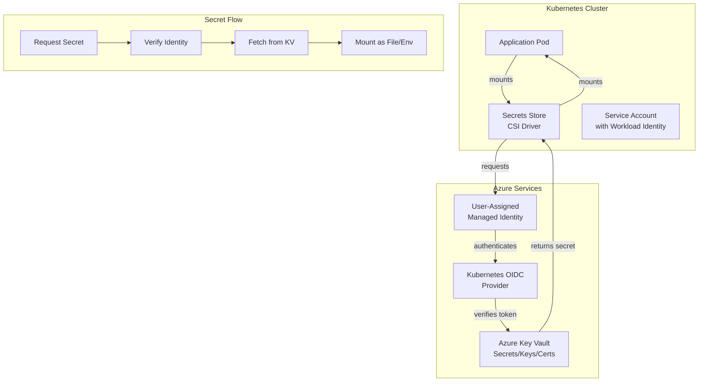

# Azure Key Vault CSI Driver Integration Guide

## Overview

This guide provides comprehensive instructions for integrating Azure Key Vault with Kubernetes using the Secrets Store CSI Driver. This enables secure secret management, automatic rotation, and workload identity-based authentication.

## Architecture Overview



## Prerequisites

### Required Tools
- Azure CLI (v2.40+)
- kubectl (v1.28+)
- Helm (v3.12+)

### Azure Resources
- Azure subscription with owner/contributor access
- Azure Key Vault instance
- Azure Container Registry (optional)

### Cluster Requirements
- AKS cluster with workload identity enabled
- OIDC issuer configured
- Workload identity addon enabled

### Permissions Required
- Contributor role on resource group
- Key Vault Administrator role for key management
- User Access Administrator for RBAC assignments

## Step 1: Setup Azure Key Vault

### 1.1 Create Key Vault

```bash
#!/bin/bash
# Setup Azure Key Vault

# Variables
RESOURCE_GROUP="myResourceGroup"
KEYVAULT_NAME="myKeyVault-$(date +%s)"
REGION="eastus"

# Create key vault
az keyvault create \
  --resource-group "$RESOURCE_GROUP" \
  --name "$KEYVAULT_NAME" \
  --location "$REGION" \
  --enable-rbac-authorization true \
  --public-network-access "Enabled" \
  --enabled-for-disk-encryption false \
  --enabled-for-template-deployment true \
  --enabled-for-deployment false

echo "Key Vault created: $KEYVAULT_NAME"
```

### 1.2 Configure Network Access

```bash
#!/bin/bash
# Configure Key Vault network access

KEYVAULT_NAME="myKeyVault"
CLUSTER_SUBNET="<subnet-id>"
VNET_RESOURCE_GROUP="myResourceGroup"

# Get Key Vault ID
KV_ID=$(az keyvault show \
  --name "$KEYVAULT_NAME" \
  --query id -o tsv)

# Add VNet rules
az keyvault network-rule add \
  --name "$KEYVAULT_NAME" \
  --subnet "$CLUSTER_SUBNET" \
  --vnet-name "myVNet" \
  --resource-group "$VNET_RESOURCE_GROUP"

# Set default action to Deny
az keyvault update \
  --name "$KEYVAULT_NAME" \
  --default-action Deny
```

### 1.3 Create Secrets

```bash
#!/bin/bash
# Create secrets in Key Vault

KEYVAULT_NAME="myKeyVault"

# Database password
az keyvault secret set \
  --vault-name "$KEYVAULT_NAME" \
  --name "DatabasePassword" \
  --value "$(openssl rand -base64 32)"

# API key
az keyvault secret set \
  --vault-name "$KEYVAULT_NAME" \
  --name "APIKey" \
  --value "sk-prod-$(uuidgen)"

# OAuth token
az keyvault secret set \
  --vault-name "$KEYVAULT_NAME" \
  --name "OAuthToken" \
  --value "$(openssl rand -hex 64)"

# TLS certificate
az keyvault certificate import \
  --vault-name "$KEYVAULT_NAME" \
  --name "AppCertificate" \
  --file "path/to/cert.pfx" \
  --password "cert-password"

# List all secrets
az keyvault secret list --vault-name "$KEYVAULT_NAME" -o table
```

### 1.4 Create Encryption Keys

```bash
#!/bin/bash
# Create encryption keys for data protection

KEYVAULT_NAME="myKeyVault"

# Create key for database encryption
az keyvault key create \
  --vault-name "$KEYVAULT_NAME" \
  --name "DatabaseEncryptionKey" \
  --kty RSA \
  --size 4096 \
  --operations encrypt decrypt

# Create key for backup encryption
az keyvault key create \
  --vault-name "$KEYVAULT_NAME" \
  --name "BackupEncryptionKey" \
  --kty RSA \
  --size 4096 \
  --operations encrypt decrypt

# List all keys
az keyvault key list --vault-name "$KEYVAULT_NAME" -o table
```

## Step 2: Enable Workload Identity

### 2.1 Configure OIDC Provider

```bash
#!/bin/bash
# Enable and configure workload identity on AKS

RESOURCE_GROUP="myResourceGroup"
CLUSTER_NAME="myAKSCluster"

# Enable workload identity
az aks update \
  --resource-group "$RESOURCE_GROUP" \
  --name "$CLUSTER_NAME" \
  --enable-oidc-issuer \
  --enable-workload-identity

# Get OIDC issuer URL
OIDC_URL=$(az aks show \
  --resource-group "$RESOURCE_GROUP" \
  --name "$CLUSTER_NAME" \
  --query "oidcIssuerProfile.issuerUrl" -o tsv)

echo "OIDC Issuer URL: $OIDC_URL"
```

### 2.2 Create User-Assigned Managed Identity

```bash
#!/bin/bash
# Create managed identity for workload authentication

RESOURCE_GROUP="myResourceGroup"
IDENTITY_NAME="aks-workload-identity"
REGION="eastus"

# Create user-assigned managed identity
az identity create \
  --resource-group "$RESOURCE_GROUP" \
  --name "$IDENTITY_NAME" \
  --location "$REGION"

# Get identity details
IDENTITY_CLIENT_ID=$(az identity show \
  --resource-group "$RESOURCE_GROUP" \
  --name "$IDENTITY_NAME" \
  --query clientId -o tsv)

IDENTITY_PRINCIPAL_ID=$(az identity show \
  --resource-group "$RESOURCE_GROUP" \
  --name "$IDENTITY_NAME" \
  --query principalId -o tsv)

echo "Client ID: $IDENTITY_CLIENT_ID"
echo "Principal ID: $IDENTITY_PRINCIPAL_ID"
```

### 2.3 Grant Key Vault Access

```bash
#!/bin/bash
# Grant managed identity access to Key Vault

KEYVAULT_NAME="myKeyVault"
IDENTITY_PRINCIPAL_ID="<principal-id>"
RESOURCE_GROUP="myResourceGroup"

# Get Key Vault ID
KV_ID=$(az keyvault show \
  --name "$KEYVAULT_NAME" \
  --query id -o tsv)

# Assign Key Vault Secrets Officer role
az role assignment create \
  --role "Key Vault Secrets Officer" \
  --assignee "$IDENTITY_PRINCIPAL_ID" \
  --scope "$KV_ID"

# Assign Key Vault Crypto Officer role (for keys)
az role assignment create \
  --role "Key Vault Crypto Officer" \
  --assignee "$IDENTITY_PRINCIPAL_ID" \
  --scope "$KV_ID"

# Assign Key Vault Certificates Officer role (for certificates)
az role assignment create \
  --role "Key Vault Certificates Officer" \
  --assignee "$IDENTITY_PRINCIPAL_ID" \
  --scope "$KV_ID"

echo "Role assignments completed"
```

## Step 3: Install CSI Driver

### 3.1 Install Secrets Store CSI Driver

```bash
#!/bin/bash
# Install Secrets Store CSI Driver and Azure Key Vault provider

# Add Helm repository
helm repo add csi-secrets-store https://kubernetes-sigs.github.io/secrets-store-csi-driver/charts

# Create namespace
kubectl create namespace csi-secrets-store

# Install CSI driver
helm install csi-secrets-store csi-secrets-store/secrets-store-csi-driver \
  --namespace csi-secrets-store \
  --set syncSecret.enabled=true \
  --set enableSecretRotation=true \
  --set rotationPollInterval=3600s

# Install Azure Key Vault provider
helm repo add azkv https://azure.github.io/secrets-store-csi-driver-provider-azure/charts

helm install csi-azure-provider azkv/csi-secrets-store-provider-azure \
  --namespace csi-secrets-store

# Verify installation
kubectl rollout status deployment/csi-secrets-store -n csi-secrets-store
kubectl rollout status deployment/csi-secrets-store-provider-azure -n csi-secrets-store
```

### 3.2 Verify CSI Driver

```bash
# Check CSI driver status
kubectl get nodes -o custom-columns=NAME:.metadata.name,CSI:.status.conditions[?(@.type=="Ready")].status

# Check driver pods
kubectl get pods -n csi-secrets-store

# Check available storage classes
kubectl get storageclasses

# Test driver functionality
kubectl apply -f - <<EOF
apiVersion: v1
kind: Pod
metadata:
  name: csi-test-pod
  namespace: default
spec:
  serviceAccountName: default
  containers:
  - name: busybox
    image: busybox
    command: ["/bin/sleep", "3600"]
    volumeMounts:
    - name: secrets-mount
      mountPath: /mnt/secrets
      readOnly: true
  volumes:
  - name: secrets-mount
    csi:
      driver: secrets-store.csi.k8s.io
      readOnly: true
      volumeAttributes:
        provider: azure
EOF

# Verify mount
kubectl exec csi-test-pod -- ls -la /mnt/secrets/
kubectl delete pod csi-test-pod
```

## Step 4: Configure Secret Provider Classes

### 4.1 Create Secret Provider Class

```bash
#!/bin/bash
# Create SecretProviderClass for Azure Key Vault

KEYVAULT_NAME="myKeyVault"
TENANT_ID=$(az account show --query tenantId -o tsv)

kubectl apply -f - <<EOF
apiVersion: secrets-store.csi.x-k8s.io/v1
kind: SecretProviderClass
metadata:
  name: app-secrets
  namespace: core-services
spec:
  provider: azure
  parameters:
    usePodIdentity: "false"
    useVMManagedIdentity: "false"
    clientID: "$IDENTITY_CLIENT_ID"
    keyvaultName: "$KEYVAULT_NAME"
    cloudName: "AzurePublicCloud"
    tenantID: "$TENANT_ID"
    objects: |
      array:
        - |
          objectName: DatabasePassword
          objectType: secret
        - |
          objectName: APIKey
          objectType: secret
        - |
          objectName: DatabaseEncryptionKey
          objectType: key
        - |
          objectName: AppCertificate
          objectType: cert
    objectsFormat: "yaml"
  secretObjects:
  - secretKey: password
    data:
    - objectName: DatabasePassword
      key: password
  - secretKey: api-key
    data:
    - objectName: APIKey
      key: api-key
EOF
```

### 4.2 Create Provider Class for Different Environments

```yaml
# Secret Provider Class for Development
apiVersion: secrets-store.csi.x-k8s.io/v1
kind: SecretProviderClass
metadata:
  name: app-secrets-dev
  namespace: core-services
spec:
  provider: azure
  parameters:
    clientID: "dev-identity-client-id"
    keyvaultName: "myKeyVaultDev"
    tenantID: "tenant-id"
    objects: |
      array:
        - objectName: DatabasePassword-Dev
          objectType: secret
        - objectName: APIKey-Dev
          objectType: secret
---
# Secret Provider Class for Production
apiVersion: secrets-store.csi.x-k8s.io/v1
kind: SecretProviderClass
metadata:
  name: app-secrets-prod
  namespace: core-services
spec:
  provider: azure
  parameters:
    clientID: "prod-identity-client-id"
    keyvaultName: "myKeyVaultProd"
    tenantID: "tenant-id"
    objects: |
      array:
        - objectName: DatabasePassword-Prod
          objectType: secret
        - objectName: APIKey-Prod
          objectType: secret
---
# Secret Provider Class with rotation
apiVersion: secrets-store.csi.x-k8s.io/v1
kind: SecretProviderClass
metadata:
  name: app-secrets-with-rotation
  namespace: core-services
spec:
  provider: azure
  parameters:
    clientID: "identity-client-id"
    keyvaultName: "myKeyVault"
    tenantID: "tenant-id"
    rotationEnabled: "true"
    rotationInterval: "3600s"
    objects: |
      array:
        - objectName: RotatingSecret
          objectType: secret
          objectVersion: ""
```

## Step 5: Integrate with Workload Identity

### 5.1 Create Service Account with Workload Identity

```bash
#!/bin/bash
# Create service account and federate with managed identity

CLUSTER_NAME="myAKSCluster"
RESOURCE_GROUP="myResourceGroup"
NAMESPACE="core-services"
SERVICE_ACCOUNT="app-identity"
IDENTITY_NAME="aks-workload-identity"

# Create service account
kubectl create namespace "$NAMESPACE" 2>/dev/null || true
kubectl create serviceaccount "$SERVICE_ACCOUNT" -n "$NAMESPACE"

# Get cluster details
OIDC_ISSUER=$(az aks show \
  --resource-group "$RESOURCE_GROUP" \
  --name "$CLUSTER_NAME" \
  --query "oidcIssuerProfile.issuerUrl" -o tsv)

# Get managed identity details
IDENTITY_CLIENT_ID=$(az identity show \
  --resource-group "$RESOURCE_GROUP" \
  --name "$IDENTITY_NAME" \
  --query clientId -o tsv)

IDENTITY_RESOURCE_ID=$(az identity show \
  --resource-group "$RESOURCE_GROUP" \
  --name "$IDENTITY_NAME" \
  --query id -o tsv)

# Create federated credential
az identity federated-credential create \
  --name "$CLUSTER_NAME-federation" \
  --identity-name "$IDENTITY_NAME" \
  --resource-group "$RESOURCE_GROUP" \
  --issuer "$OIDC_ISSUER" \
  --subject "system:serviceaccount:$NAMESPACE:$SERVICE_ACCOUNT"

# Annotate service account
kubectl annotate serviceaccount "$SERVICE_ACCOUNT" \
  -n "$NAMESPACE" \
  azure.workload.identity/client-id="$IDENTITY_CLIENT_ID" \
  --overwrite

# Label service account for workload identity
kubectl label serviceaccount "$SERVICE_ACCOUNT" \
  -n "$NAMESPACE" \
  azure.workload.identity/use=true \
  --overwrite

echo "Service account configured with workload identity"
```

### 5.2 Verify Workload Identity

```bash
#!/bin/bash
# Verify workload identity configuration

NAMESPACE="core-services"
SERVICE_ACCOUNT="app-identity"

# Check service account annotations
echo "Service Account Annotations:"
kubectl get sa "$SERVICE_ACCOUNT" -n "$NAMESPACE" -o jsonpath='{.metadata.annotations}' | jq .

# Check federated credentials
echo -e "\nFederated Credentials:"
az identity federated-credential list \
  --identity-name "aks-workload-identity" \
  --resource-group "myResourceGroup" -o table

# Test identity access
kubectl apply -f - <<EOF
apiVersion: v1
kind: Pod
metadata:
  name: identity-test
  namespace: $NAMESPACE
spec:
  serviceAccountName: $SERVICE_ACCOUNT
  containers:
  - name: test
    image: mcr.microsoft.com/aks/fundamental/base-ubuntu:v0.0.11
    command: ["sleep", "3600"]
  restartPolicy: Never
EOF

# Wait for pod and test
sleep 5
kubectl exec -it identity-test -n "$NAMESPACE" -- bash -c \
  'curl -s -H "Metadata:true" "http://169.254.169.254/metadata/identity/oauth2/token?api-version=2017-09-01&resource=https://vault.azure.net" | jq .'

kubectl delete pod identity-test -n "$NAMESPACE"
```

## Step 6: Deploy Applications with Secrets

### 6.1 Deploy Application Using Secrets

```yaml
apiVersion: apps/v1
kind: Deployment
metadata:
  name: app-with-secrets
  namespace: core-services
spec:
  replicas: 3
  selector:
    matchLabels:
      app: app-with-secrets
  template:
    metadata:
      labels:
        app: app-with-secrets
    spec:
      serviceAccountName: app-identity
      containers:
      - name: app
        image: myacr.azurecr.io/app:v1.0.0
        ports:
        - containerPort: 8080
        env:
        # From Kubernetes secrets synced from Key Vault
        - name: DATABASE_PASSWORD
          valueFrom:
            secretKeyRef:
              name: kv-secrets
              key: password
        - name: API_KEY
          valueFrom:
            secretKeyRef:
              name: kv-secrets
              key: api-key
        # From mounted files
        - name: CERT_PATH
          value: /mnt/secrets/cert.crt
        volumeMounts:
        # Mount Key Vault secrets
        - name: secrets-volume
          mountPath: /mnt/secrets
          readOnly: true
        resources:
          requests:
            cpu: 250m
            memory: 512Mi
          limits:
            cpu: 500m
            memory: 1Gi
      volumes:
      # CSI secrets store volume
      - name: secrets-volume
        csi:
          driver: secrets-store.csi.k8s.io
          readOnly: true
          volumeAttributes:
            provider: azure
          nodePublishSecretRef:
            name: secrets-store-creds
---
# Secret for synced Key Vault secrets
apiVersion: v1
kind: Secret
metadata:
  name: kv-secrets
  namespace: core-services
type: Opaque
stringData:
  password: "placeholder"  # Will be synced from Key Vault
  api-key: "placeholder"   # Will be synced from Key Vault
```

### 6.2 Deploy with Secret Rotation

```yaml
apiVersion: apps/v1
kind: Deployment
metadata:
  name: app-with-rotation
  namespace: core-services
spec:
  replicas: 2
  selector:
    matchLabels:
      app: app-with-rotation
  template:
    metadata:
      labels:
        app: app-with-rotation
      annotations:
        # Automatically reload pod when secrets rotate
        checksum/config: "{{ include (print $.Template.BasePath \"/config.yaml\") . | sha256sum }}"
    spec:
      serviceAccountName: app-identity
      containers:
      - name: app
        image: myacr.azurecr.io/app:v1.0.0
        ports:
        - containerPort: 8080
        volumeMounts:
        - name: secrets
          mountPath: /mnt/secrets
          readOnly: true
        lifecycle:
          postStart:
            exec:
              command: ["/bin/sh", "-c", "sleep 5 && kill -HUP 1"]
      volumes:
      - name: secrets
        csi:
          driver: secrets-store.csi.k8s.io
          readOnly: true
          volumeAttributes:
            provider: azure
            rotationEnabled: "true"
            rotationInterval: "3600s"
```

## Step 7: Secret Rotation & Refresh

### 7.1 Configure Automatic Rotation

```bash
#!/bin/bash
# Configure secret rotation

kubectl apply -f - <<EOF
apiVersion: v1
kind: ConfigMap
metadata:
  name: csi-rotation-config
  namespace: csi-secrets-store
data:
  rotation-enabled: "true"
  rotation-interval: "3600"  # 1 hour
  rotation-check-interval: "60"  # Check every minute
EOF

# Update CSI driver with rotation enabled
helm upgrade csi-secrets-store csi-secrets-store/secrets-store-csi-driver \
  --namespace csi-secrets-store \
  --set enableSecretRotation=true \
  --set rotationPollInterval=60s
```

### 7.2 Manually Trigger Secret Update

```bash
#!/bin/bash
# Manually refresh secrets

NAMESPACE="core-services"
POD_NAME="app-with-secrets-<hash>"

# Force pod restart to refresh secrets
kubectl rollout restart deployment/app-with-secrets -n "$NAMESPACE"

# Monitor rotation
kubectl logs -n "$NAMESPACE" "$POD_NAME" -f | grep -i "secret\|rotate"
```

### 7.3 Update Secrets in Key Vault

```bash
#!/bin/bash
# Update secret in Key Vault and sync to cluster

KEYVAULT_NAME="myKeyVault"
SECRET_NAME="DatabasePassword"
NEW_PASSWORD=$(openssl rand -base64 32)

# Update in Key Vault
az keyvault secret set \
  --vault-name "$KEYVAULT_NAME" \
  --name "$SECRET_NAME" \
  --value "$NEW_PASSWORD"

echo "Secret updated in Key Vault: $SECRET_NAME"
echo "New value will be available to pods within rotation interval"

# Force immediate sync (restart pods)
kubectl rollout restart deployment/app-with-secrets -n core-services
```

## Troubleshooting

### Issue: Secret Mount Empty

```bash
# Check CSI driver logs
kubectl logs -n csi-secrets-store -l app=secrets-store-csi-driver -f

# Check Azure provider logs
kubectl logs -n csi-secrets-store -l app=csi-secrets-store-provider-azure -f

# Check pod mount
kubectl exec -it <pod-name> -n <namespace> -- ls -la /mnt/secrets/

# Verify Secret Provider Class
kubectl get secretproviderclass -n <namespace> -o yaml
```

### Issue: Authentication Failure

```bash
# Check service account annotations
kubectl describe sa app-identity -n core-services

# Check federated credentials
az identity federated-credential list \
  --identity-name "aks-workload-identity" \
  --resource-group "myResourceGroup"

# Test identity token
kubectl exec -it <pod-name> -n <namespace> -- curl -s \
  -H "Metadata:true" \
  "http://169.254.169.254/metadata/identity/oauth2/token?api-version=2017-09-01&resource=https://vault.azure.net" | jq .
```

### Issue: Key Vault Access Denied

```bash
# Check role assignments
az role assignment list \
  --scope "$(az keyvault show --name myKeyVault --query id -o tsv)" \
  --output table

# Verify managed identity has proper permissions
PRINCIPAL_ID=$(az identity show \
  --name "aks-workload-identity" \
  --resource-group "myResourceGroup" \
  --query principalId -o tsv)

az role assignment list \
  --assignee "$PRINCIPAL_ID" \
  --output table
```

## Best Practices

1. **Use Workload Identity**: Always use workload identity instead of pod identity
2. **Least Privilege**: Grant minimum required permissions
3. **Enable Rotation**: Enable automatic secret rotation
4. **Monitor Access**: Log and monitor all Key Vault access
5. **Network Security**: Use private endpoints for Key Vault
6. **Secret Naming**: Use clear, environment-specific naming
7. **Backup Keys**: Back up encryption keys regularly
8. **Audit Logs**: Enable and review Key Vault audit logs

## References

- [Azure Key Vault Documentation](https://learn.microsoft.com/en-us/azure/key-vault/)
- [Secrets Store CSI Driver](https://secrets-store-csi-driver.sigs.k8s.io/)
- [Workload Identity Documentation](https://azure.github.io/workload-identity/)
- [Azure Key Vault Managed Identity](https://learn.microsoft.com/en-us/azure/active-directory/managed-identities-azure-resources/)
