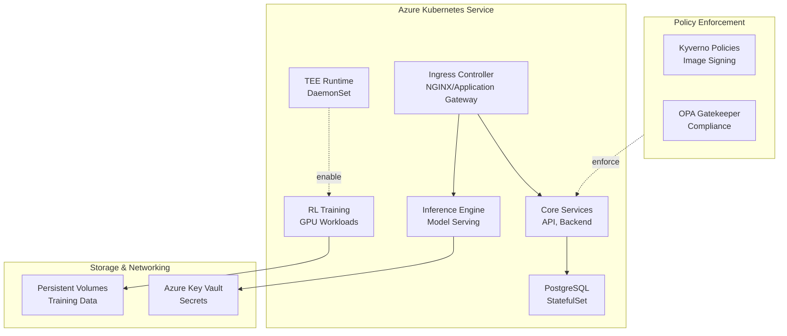

# Kubernetes Deployment Guide - AI ENERGY Optimizer

## Overview

This guide provides comprehensive instructions for deploying and managing AI ENERGY Optimizer applications on Azure Kubernetes Service (AKS) with security-hardened configurations, GPU support, and Trusted Execution Environment (TEE) integration.

## Architecture Overview



## Prerequisites

### Required Tools
- Azure CLI (v2.40+)
- kubectl (v1.28+)
- Helm (v3.12+)
- Terraform (v1.6+, if using IaC)

### Azure Resources
- Azure subscription with contributor access
- Resource Group created
- Azure Container Registry (ACR)
- Azure Key Vault instance

### Access Requirements
- Kubeconfig configured for AKS cluster
- RBAC roles: Kubernetes admin, ACR pull permissions

### Network Prerequisites
- Virtual Network with appropriate subnets
- Network Security Groups configured
- Private Endpoint support (optional)

## Step 1: Cluster Setup

### 1.1 Create AKS Cluster

```bash
# Set variables
RESOURCE_GROUP="myResourceGroup"
CLUSTER_NAME="production-aks"
REGION="eastus"
NODE_COUNT=3
GPU_NODE_COUNT=2

# Create resource group
az group create \
  --name "$RESOURCE_GROUP" \
  --location "$REGION"

# Create AKS cluster with security features
az aks create \
  --resource-group "$RESOURCE_GROUP" \
  --name "$CLUSTER_NAME" \
  --node-count "$NODE_COUNT" \
  --vm-set-type VirtualMachineScaleSets \
  --load-balancer-sku standard \
  --enable-managed-identity \
  --network-plugin azure \
  --network-policy azure \
  --enable-pod-identity \
  --enable-workload-identity \
  --enable-aad \
  --enable-azure-keyvault-kms \
  --kubernetes-version 1.28 \
  --os-disk-size-gb 100 \
  --enable-cluster-autoscaling \
  --min-count 3 \
  --max-count 10 \
  --zones 1 2 3 \
  --output json > cluster-config.json
```

### 1.2 Add GPU Node Pool

```bash
# Create GPU node pool for ML workloads
az aks nodepool add \
  --resource-group "$RESOURCE_GROUP" \
  --cluster-name "$CLUSTER_NAME" \
  --name "gpupool" \
  --node-count "$GPU_NODE_COUNT" \
  --node-vm-size Standard_NC6s_v3 \
  --enable-cluster-autoscaling \
  --min-count 1 \
  --max-count 5 \
  --mode User \
  --zones 1 2

# Label GPU nodes for TEE workloads
kubectl label nodes -l agentpool=gpupool workload-type=tee-gpu
```

### 1.3 Configure kubeconfig

```bash
# Get kubeconfig credentials
az aks get-credentials \
  --resource-group "$RESOURCE_GROUP" \
  --name "$CLUSTER_NAME" \
  --admin

# Verify cluster connectivity
kubectl cluster-info
kubectl get nodes -o wide
kubectl get pods --all-namespaces
```

### 1.4 Enable Required Features

```bash
# Enable Azure Key Vault Provider for Secrets Store CSI Driver
az aks enable-addons \
  --addons azure-keyvault-secrets-provider \
  --resource-group "$RESOURCE_GROUP" \
  --name "$CLUSTER_NAME"

# Enable Azure Monitor for container insights
az aks enable-addons \
  --addons monitoring \
  --resource-group "$RESOURCE_GROUP" \
  --name "$CLUSTER_NAME"
```

## Step 2: Install Required Components

### 2.1 Install Helm Charts Prerequisites

```bash
# Create namespaces
kubectl create namespace core-services
kubectl create namespace inference
kubectl create namespace training
kubectl create namespace monitoring
kubectl create namespace kyverno
kubectl create namespace gatekeeper
kubectl create namespace tee-runtime

# Label namespaces for policy enforcement
kubectl label namespace core-services pod-security=restricted
kubectl label namespace inference pod-security=restricted
kubectl label namespace training pod-security=restricted
```

### 2.2 Add Helm Repositories

```bash
# PostgreSQL
helm repo add bitnami https://charts.bitnami.com/bitnami

# Kyverno
helm repo add kyverno https://kyverno.github.io/kyverno/

# OPA Gatekeeper
helm repo add gatekeeper https://open-policy-agent.github.io/gatekeeper/charts

# NGINX Ingress
helm repo add ingress-nginx https://kubernetes.github.io/ingress-nginx

# Prometheus (monitoring)
helm repo add prometheus-community https://prometheus-community.github.io/helm-charts

# Update repos
helm repo update
```

### 2.3 Install Kyverno (Image Policy)

```bash
helm install kyverno kyverno/kyverno \
  --namespace kyverno \
  --create-namespace \
  --set replicaCount=3 \
  --set config.webhooks[0].failurePolicy=fail \
  --values - <<EOF
podSecurityPolicy:
  enabled: true
EOF

# Verify installation
kubectl rollout status deployment/kyverno -n kyverno
```

### 2.4 Install OPA Gatekeeper

```bash
helm install gatekeeper gatekeeper/gatekeeper \
  --namespace gatekeeper \
  --create-namespace \
  --set enableExternalData=true \
  --set enableGenerateStats=true \
  --set audit.replicas=1

# Verify installation
kubectl rollout status deployment/gatekeeper -n gatekeeper
```

### 2.5 Install NGINX Ingress Controller

```bash
helm install nginx-ingress ingress-nginx/ingress-nginx \
  --namespace ingress-nginx \
  --create-namespace \
  --set controller.replicaCount=3 \
  --set controller.service.type=LoadBalancer \
  --set controller.metrics.enabled=true

# Get LoadBalancer IP
kubectl get service -n ingress-nginx nginx-ingress-ingress-nginx \
  --watch
```

## Step 3: Deploy Helm Charts

### 3.1 Deploy Core Services

```bash
# Determine environment
ENVIRONMENT=prod  # dev, staging, prod

# Deploy core services
helm install core-services ./infrastructure/helm/core-services \
  --namespace core-services \
  --values ./infrastructure/helm/core-services/values-${ENVIRONMENT}.yaml \
  --set image.registry="myacr.azurecr.io" \
  --set image.tag="latest" \
  --set replicaCount=3

# Verify deployment
kubectl rollout status deployment/core-services -n core-services
kubectl get pods -n core-services
```

### 3.2 Deploy PostgreSQL

```bash
helm install postgres bitnami/postgresql \
  --namespace core-services \
  --values ./infrastructure/helm/postgres/values-${ENVIRONMENT}.yaml \
  --set auth.postgresPassword=$(openssl rand -base64 32) \
  --set persistence.size=50Gi

# Wait for StatefulSet
kubectl rollout status statefulset/postgres-postgresql -n core-services
```

### 3.3 Deploy Inference Engine

```bash
helm install inference ./infrastructure/helm/inference \
  --namespace inference \
  --values ./infrastructure/helm/inference/values-${ENVIRONMENT}.yaml \
  --set image.registry="myacr.azurecr.io" \
  --set replicaCount=2 \
  --set resources.limits.nvidia\.com/gpu=1
```

### 3.4 Deploy RL Training

```bash
helm install rl-training ./infrastructure/helm/rl-training \
  --namespace training \
  --values ./infrastructure/helm/rl-training/values-${ENVIRONMENT}.yaml \
  --set image.registry="myacr.azurecr.io" \
  --set nodeSelector.workload-type=tee-gpu
```

### 3.5 Deploy TEE Runtime DaemonSet

```bash
helm install tee-runtime ./infrastructure/helm/tee-runtime \
  --namespace tee-runtime \
  --values ./infrastructure/helm/tee-runtime/values-${ENVIRONMENT}.yaml \
  --set nodeSelector.workload-type=tee-gpu
```

### 3.6 Deploy Ingress Configuration

```bash
helm install ingress-config ./infrastructure/helm/ingress \
  --namespace ingress-nginx \
  --values ./infrastructure/helm/ingress/values-${ENVIRONMENT}.yaml
```

## Step 4: Apply Security Policies

### 4.1 Apply Kyverno Policies

```bash
# Apply image signing policy
kubectl apply -f infrastructure/policies/kyverno/policies/require-signed-images.yaml

# Apply pod security policies
kubectl apply -f infrastructure/policies/kyverno/policies/block-privileged-containers.yaml
kubectl apply -f infrastructure/policies/kyverno/policies/validate-non-root-user.yaml

# Apply TEE enforcement (if applicable)
kubectl apply -f infrastructure/policies/kyverno/policies/enforce-kata-runtime-on-tee.yaml

# Verify policies
kubectl get clusterpolicies
```

### 4.2 Apply Gatekeeper Constraints

```bash
# Install constraint templates
kubectl apply -f infrastructure/policies/gatekeeper/templates/

# Apply constraints
kubectl apply -f infrastructure/policies/gatekeeper/constraints/

# Verify constraints
kubectl get constraints
kubectl get constrainttemplates
```

## Step 5: Verification Steps

### 5.1 Verify Cluster Health

```bash
# Check cluster status
kubectl get nodes
kubectl get nodes -o wide

# Verify all namespaces
kubectl get namespaces

# Check system pods
kubectl get pods --all-namespaces

# Verify node resources
kubectl describe nodes | grep -A5 "Allocated resources"
```

### 5.2 Verify Deployments

```bash
# Check all deployments
kubectl get deployments --all-namespaces

# View deployment details
kubectl describe deployment core-services -n core-services

# Check pod logs
kubectl logs -n core-services -l app=core-services --tail=50

# Verify rollout status
kubectl rollout status deployment/core-services -n core-services
```

### 5.3 Verify Stateful Services

```bash
# Check PostgreSQL StatefulSet
kubectl get statefulset -n core-services
kubectl logs -n core-services postgres-postgresql-0

# Test database connectivity
kubectl exec -it postgres-postgresql-0 -n core-services -- \
  psql -U postgres -c "SELECT version();"
```

### 5.4 Verify Ingress

```bash
# Check ingress configuration
kubectl get ingress --all-namespaces

# Get external IP
kubectl get svc -n ingress-nginx

# Test endpoint
curl -H "Host: api.example.com" http://<EXTERNAL-IP>
```

### 5.5 Verify Security Policies

```bash
# Check Kyverno policies
kubectl get clusterpolicies

# Test policy enforcement
kubectl run test-pod --image=untrusted-image:latest \
  --dry-run=server -o yaml 2>&1 | grep -i "validation"

# Check Gatekeeper violations
kubectl get constraints -o json | \
  jq '.items[].status.totalViolations'
```

### 5.6 Verify TEE Integration

```bash
# Check TEE runtime DaemonSet
kubectl get daemonset -n tee-runtime

# Verify TEE nodes
kubectl get nodes -L workload-type

# Check TEE pod resources
kubectl get pods -n training -o json | \
  jq '.items[].spec.containers[].resources'
```

### 5.7 Verify Monitoring Setup

```bash
# Check monitoring namespace
kubectl get all -n monitoring

# Port-forward to Prometheus
kubectl port-forward -n monitoring svc/prometheus 9090:9090

# Port-forward to Grafana
kubectl port-forward -n monitoring svc/grafana 3000:3000
```

## Monitoring and Health Checks

### Setup Health Checks

```bash
# Create monitoring rules
kubectl apply -f - <<EOF
apiVersion: v1
kind: ConfigMap
metadata:
  name: health-check-config
  namespace: monitoring
data:
  checks.yaml: |
    checks:
      - pod_restart_count > 5
      - node_cpu_usage > 80
      - pod_memory_usage > 85
EOF

# Monitor cluster events
kubectl get events --all-namespaces --sort-by='.lastTimestamp'

# Setup log aggregation
kubectl logs --all-namespaces -f --timestamps=true
```

### Resource Monitoring

```bash
# View cluster resource usage
kubectl top nodes
kubectl top pods --all-namespaces

# Monitor persistent volumes
kubectl get pv
kubectl get pvc --all-namespaces
```

## Troubleshooting

### Common Issues and Solutions

#### Issue: Pod Fails to Start
```bash
# Check pod status
kubectl describe pod <pod-name> -n <namespace>

# View pod logs
kubectl logs <pod-name> -n <namespace> --previous

# Check resource constraints
kubectl describe nodes

# Check security policies
kubectl get clusterpolicies -o json | jq '.items[].spec.validationFailureAction'
```

#### Issue: Image Pull Errors
```bash
# Verify ACR credentials
kubectl get secrets -n <namespace> | grep docker

# Test ACR access
az acr login --name myacr

# Update image pull secret
kubectl create secret docker-registry regcred \
  --docker-server=myacr.azurecr.io \
  --docker-username=<username> \
  --docker-password=<password> \
  -n <namespace>
```

#### Issue: Persistent Volume Not Mounting
```bash
# Check PVC status
kubectl get pvc -n <namespace>
kubectl describe pvc <pvc-name> -n <namespace>

# Check PV status
kubectl get pv
kubectl describe pv <pv-name>

# Check storage class
kubectl get storageclass
```

#### Issue: Policy Violation Errors
```bash
# View policy details
kubectl get clusterpolicy <policy-name> -o yaml

# Check policy audit logs
kubectl logs -n kyverno -l app=kyverno

# Temporarily disable policy
kubectl patch clusterpolicy <policy-name> \
  --type='json' -p='[{"op": "replace", "path": "/spec/validationFailureAction", "value":"audit"}]'
```

#### Issue: Network Connectivity Issues
```bash
# Test pod-to-pod connectivity
kubectl run -it --image=busybox debug-pod -- sh
# Inside pod: nc -zv <service-name> <port>

# Check DNS
kubectl run -it --image=busybox debug-pod -- nslookup <service-name>

# View network policies
kubectl get networkpolicies --all-namespaces
```

## Best Practices

### Deployment Best Practices
1. **Use GitOps**: Manage all configurations in Git with automated deployments
2. **Resource Limits**: Always set CPU and memory requests/limits
3. **Health Checks**: Implement readiness and liveness probes
4. **Rolling Updates**: Use RollingUpdate strategy with proper minAvailable
5. **Pod Disruption Budgets**: Protect critical workloads during maintenance

### Security Best Practices
1. **Network Policies**: Restrict traffic between namespaces
2. **RBAC**: Use least privilege principle
3. **Pod Security Policies**: Enforce security standards
4. **Image Scanning**: Scan images before deployment
5. **Secret Management**: Use Azure Key Vault, not ConfigMaps
6. **Audit Logging**: Enable and monitor audit logs

### Operational Best Practices
1. **Namespace Isolation**: Separate environments by namespace
2. **Resource Quotas**: Set quotas per namespace
3. **Monitoring**: Implement comprehensive monitoring
4. **Backup Strategy**: Regular etcd and persistent volume backups
5. **Incident Response**: Document and practice response procedures
6. **Documentation**: Keep runbooks updated

### Performance Best Practices
1. **Node Affinity**: Schedule pods on appropriate nodes
2. **Pod Disruption Budgets**: Ensure service availability
3. **Cluster Autoscaling**: Enable for dynamic workloads
4. **Resource Optimization**: Right-size requests and limits
5. **Batch Operations**: Use batch jobs for non-critical work

## Cleanup and Teardown

### Remove Helm Releases
```bash
# List releases
helm list --all-namespaces

# Delete releases
helm uninstall core-services -n core-services
helm uninstall postgres -n core-services
helm uninstall inference -n inference
helm uninstall rl-training -n training
helm uninstall tee-runtime -n tee-runtime
```

### Delete Namespaces
```bash
# Delete namespaces (cascades to all resources)
kubectl delete namespace core-services
kubectl delete namespace inference
kubectl delete namespace training
kubectl delete namespace monitoring
```

### Delete AKS Cluster
```bash
# Delete cluster (irreversible)
az aks delete \
  --resource-group "$RESOURCE_GROUP" \
  --name "$CLUSTER_NAME" \
  --yes --no-wait
```

## References

- [Azure AKS Documentation](https://learn.microsoft.com/en-us/azure/aks/)
- [Kubernetes Official Documentation](https://kubernetes.io/docs/)
- [Helm Documentation](https://helm.sh/docs/)
- [Kyverno Documentation](https://kyverno.io/)
- [OPA Gatekeeper Documentation](https://open-policy-agent.github.io/gatekeeper/)
