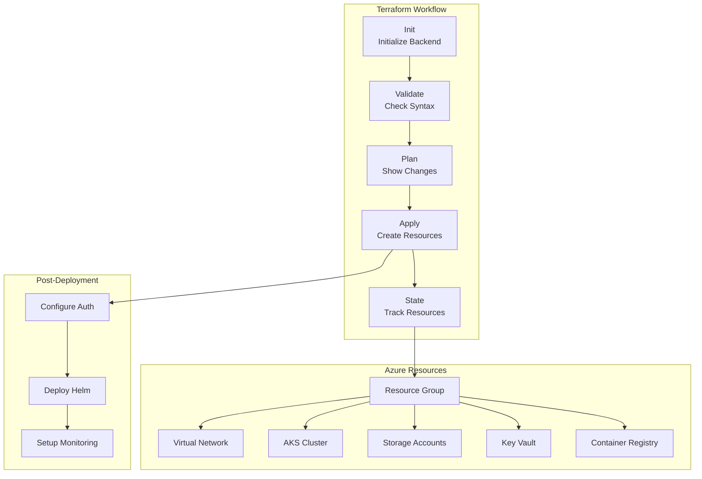

# Terraform Deployment Guide - AI ENERGY Optimizer

## Overview

This guide provides comprehensive instructions for deploying AI ENERGY Optimizer infrastructure using Terraform. It covers infrastructure provisioning, state management, variable configuration, and best practices for managing Azure resources.

## Architecture Deployment Flow



## Prerequisites

### Required Tools

```bash
# Install Terraform
# macOS
brew install terraform

# Linux
wget https://releases.hashicorp.com/terraform/1.6.0/terraform_1.6.0_linux_amd64.zip
unzip terraform_1.6.0_linux_amd64.zip
sudo mv terraform /usr/local/bin/

# Verify installation
terraform version  # Should be v1.6+
```

### Azure Setup

```bash
# Install Azure CLI
curl -sL https://aka.ms/InstallAzureCLIDeb | sudo bash

# Authenticate with Azure
az login

# Set active subscription
az account set --subscription "<subscription-id>"

# Verify authentication
az account show
```

### Project Structure

```
infrastructure/terraform/
├── main.tf                    # Primary resources
├── variables.tf               # Variable definitions
├── outputs.tf                 # Output values
├── networking.tf              # Network resources
├── aks.tf                      # Kubernetes cluster
├── security.tf                # Security policies
├── monitoring.tf              # Monitoring setup
├── terraform.tfvars           # Variable values
├── terraform.tfvars.example   # Example values
├── backend.tf                 # State backend config
└── .gitignore                 # Git ignore rules
```

## Step 1: Initialize Terraform

### 1.1 Configure Backend Storage

```bash
#!/bin/bash
# Setup Terraform backend in Azure Storage

RESOURCE_GROUP="terraform-rg"
STORAGE_ACCOUNT_NAME="tfstate$(date +%s)"
CONTAINER_NAME="tfstate"
REGION="eastus"

# Create resource group
az group create \
  --name "$RESOURCE_GROUP" \
  --location "$REGION"

# Create storage account
az storage account create \
  --name "$STORAGE_ACCOUNT_NAME" \
  --resource-group "$RESOURCE_GROUP" \
  --location "$REGION" \
  --sku Standard_LRS \
  --encryption-services blob \
  --https-only true \
  --kind StorageV2

# Create blob container
az storage container create \
  --name "$CONTAINER_NAME" \
  --account-name "$STORAGE_ACCOUNT_NAME"

# Get storage account key
STORAGE_ACCOUNT_KEY=$(az storage account keys list \
  --account-name "$STORAGE_ACCOUNT_NAME" \
  --query "[0].value" -o tsv)

echo "Storage Account: $STORAGE_ACCOUNT_NAME"
echo "Storage Key: $STORAGE_ACCOUNT_KEY"
```

### 1.2 Create Backend Configuration

```hcl
# backend.tf
terraform {
  backend "azurerm" {
    resource_group_name  = "terraform-rg"
    storage_account_name = "tfstate<timestamp>"
    container_name       = "tfstate"
    key                  = "prod.tfstate"
    
    # Set via environment variables or -backend-config
    # subscription_id = ""
    # tenant_id       = ""
    # client_id       = ""
    # client_secret   = ""
  }
}
```

### 1.3 Initialize Terraform

```bash
#!/bin/bash
# Initialize Terraform

cd infrastructure/terraform/

# Export backend configuration
export ARM_SUBSCRIPTION_ID="<subscription-id>"
export ARM_TENANT_ID="<tenant-id>"
export ARM_CLIENT_ID="<client-id>"
export ARM_CLIENT_SECRET="<client-secret>"

# Initialize Terraform
terraform init \
  -backend-config="subscription_id=$ARM_SUBSCRIPTION_ID" \
  -backend-config="tenant_id=$ARM_TENANT_ID" \
  -backend-config="client_id=$ARM_CLIENT_ID" \
  -backend-config="client_secret=$ARM_CLIENT_SECRET"

# Verify initialization
terraform version
terraform backend validate
```

## Step 2: Configure Variables

### 2.1 Define Variables

```hcl
# variables.tf

variable "environment" {
  description = "Environment name"
  type        = string
  default     = "prod"
  validation {
    condition     = contains(["dev", "staging", "prod"], var.environment)
    error_message = "Environment must be dev, staging, or prod."
  }
}

variable "region" {
  description = "Azure region"
  type        = string
  default     = "eastus"
}

variable "project_name" {
  description = "Project name"
  type        = string
  default     = "myproject"
}

variable "kubernetes_version" {
  description = "Kubernetes version"
  type        = string
  default     = "1.28"
}

variable "aks_node_count" {
  description = "Number of AKS nodes"
  type        = number
  default     = 3
  validation {
    condition     = var.aks_node_count >= 1 && var.aks_node_count <= 100
    error_message = "Node count must be between 1 and 100."
  }
}

variable "gpu_node_count" {
  description = "Number of GPU nodes"
  type        = number
  default     = 2
}

variable "vm_sizes" {
  description = "VM sizes for different node pools"
  type = object({
    system = string
    gpu    = string
    tee    = string
  })
  default = {
    system = "Standard_D4s_v3"
    gpu    = "Standard_NC6s_v3"
    tee    = "Standard_DC4s_v2"
  }
}

variable "enable_monitoring" {
  description = "Enable Azure Monitor"
  type        = bool
  default     = true
}

variable "enable_kms_encryption" {
  description = "Enable Azure Key Vault KMS encryption"
  type        = bool
  default     = true
}

variable "tags" {
  description = "Common resource tags"
  type        = map(string)
  default = {
    Environment = "prod"
    ManagedBy   = "Terraform"
  }
}
```

### 2.2 Create tfvars Files

```hcl
# terraform.tfvars.prod
environment         = "prod"
region              = "eastus"
project_name        = "myproject"
kubernetes_version  = "1.28"
aks_node_count      = 5
gpu_node_count      = 2
enable_monitoring   = true
enable_kms_encryption = true

tags = {
  Environment = "production"
  ManagedBy   = "Terraform"
  CostCenter  = "engineering"
}
```

```hcl
# terraform.tfvars.staging
environment         = "staging"
region              = "eastus"
project_name        = "myproject"
kubernetes_version  = "1.28"
aks_node_count      = 2
gpu_node_count      = 1
enable_monitoring   = true
enable_kms_encryption = true
```

```hcl
# terraform.tfvars.dev
environment         = "dev"
region              = "eastus"
project_name        = "myproject"
kubernetes_version  = "1.28"
aks_node_count      = 1
gpu_node_count      = 0
enable_monitoring   = false
enable_kms_encryption = false
```

## Step 3: Validate Configuration

### 3.1 Validate Terraform Syntax

```bash
#!/bin/bash
# Validate Terraform configuration

cd infrastructure/terraform/

# Validate syntax
terraform validate

# Format check
terraform fmt -check -recursive

# Format and rewrite
terraform fmt -recursive

# Lint with TFLint
tflint .
tflint --init  # Initialize TFLint
```

### 3.2 Plan Deployment

```bash
#!/bin/bash
# Plan infrastructure changes

cd infrastructure/terraform/

# Select tfvars file
ENVIRONMENT="prod"

# Create plan
terraform plan \
  -var-file="terraform.tfvars.${ENVIRONMENT}" \
  -out="tfplan.${ENVIRONMENT}"

# Review plan
terraform show "tfplan.${ENVIRONMENT}"

# Save plan to file for review
terraform plan \
  -var-file="terraform.tfvars.${ENVIRONMENT}" \
  -out="tfplan.${ENVIRONMENT}" \
  > "plan-${ENVIRONMENT}.txt"

echo "Plan saved to plan-${ENVIRONMENT}.txt"
```

## Step 4: Deploy Infrastructure

### 4.1 Apply Terraform Configuration

```bash
#!/bin/bash
# Apply Terraform configuration

cd infrastructure/terraform/

ENVIRONMENT="prod"

# Apply with plan
terraform apply "tfplan.${ENVIRONMENT}"

# Or apply directly
terraform apply \
  -var-file="terraform.tfvars.${ENVIRONMENT}" \
  -auto-approve

# Wait for completion
echo "Waiting for resources to be created..."
sleep 60
```

### 4.2 Monitor Deployment

```bash
#!/bin/bash
# Monitor deployment progress

# Watch resource group
az group show \
  --name "rg-${ENVIRONMENT}-myproject" \
  --output table

# Check AKS cluster status
az aks show \
  --resource-group "rg-${ENVIRONMENT}-myproject" \
  --name "aks-${ENVIRONMENT}-myproject" \
  --output table

# Monitor node creation
kubectl get nodes -w

# Check resource quotas
kubectl describe resourcequota --all-namespaces
```

## Step 5: State Management

### 5.1 Inspect Terraform State

```bash
#!/bin/bash
# Inspect Terraform state

# Show full state
terraform show

# List all resources
terraform state list

# Show specific resource
terraform state show 'azurerm_kubernetes_cluster.main'

# Export state data
terraform state pull > terraform.tfstate.backup
```

### 5.2 Backup and Migrate State

```bash
#!/bin/bash
# Backup state file

TIMESTAMP=$(date +%Y%m%d_%H%M%S)

# Backup local state
cp terraform.tfstate "terraform.tfstate.backup.${TIMESTAMP}"

# Backup remote state
terraform state pull > "terraform.tfstate.remote.backup.${TIMESTAMP}"

# Verify backup
ls -lh terraform.tfstate*

# Keep backups secure
chmod 600 terraform.tfstate*
```

### 5.3 Lock/Unlock State

```bash
#!/bin/bash
# Manage state locks

# Force unlock (use carefully)
terraform force-unlock <lock-id>

# Check for state locks
terraform state list | head -1

# Refresh state
terraform refresh -var-file="terraform.tfvars.prod"
```

## Step 6: Output and Configuration

### 6.1 Define Outputs

```hcl
# outputs.tf

output "aks_cluster_name" {
  description = "Name of the AKS cluster"
  value       = azurerm_kubernetes_cluster.main.name
}

output "aks_cluster_id" {
  description = "ID of the AKS cluster"
  value       = azurerm_kubernetes_cluster.main.id
}

output "kube_config" {
  description = "Kubernetes configuration"
  value       = azurerm_kubernetes_cluster.main.kube_config_raw
  sensitive   = true
}

output "resource_group_name" {
  description = "Name of the resource group"
  value       = azurerm_resource_group.main.name
}

output "acr_login_server" {
  description = "ACR login server"
  value       = azurerm_container_registry.main.login_server
}

output "key_vault_id" {
  description = "Key Vault resource ID"
  value       = azurerm_key_vault.main.id
}
```

### 6.2 Extract Outputs

```bash
#!/bin/bash
# Extract outputs

# Show all outputs
terraform output

# Show specific output
terraform output -raw aks_cluster_name

# Export to JSON
terraform output -json > outputs.json

# Use in script
CLUSTER_NAME=$(terraform output -raw aks_cluster_name)
RG_NAME=$(terraform output -raw resource_group_name)

# Configure kubectl
az aks get-credentials \
  --resource-group "$RG_NAME" \
  --name "$CLUSTER_NAME"
```

## Step 7: Updates and Modifications

### 7.1 Update Resources

```bash
#!/bin/bash
# Update infrastructure

cd infrastructure/terraform/

ENVIRONMENT="prod"

# Edit tfvars
nano "terraform.tfvars.${ENVIRONMENT}"

# Plan changes
terraform plan \
  -var-file="terraform.tfvars.${ENVIRONMENT}" \
  -out="tfplan.update"

# Review changes
terraform show tfplan.update

# Apply changes
terraform apply tfplan.update
```

### 7.2 Scale AKS Cluster

```bash
#!/bin/bash
# Scale AKS cluster

# Modify tfvars
sed -i 's/aks_node_count.*=.*/aks_node_count = 5/' terraform.tfvars.prod

# Plan scaling
terraform plan \
  -var-file="terraform.tfvars.prod" \
  -out="tfplan.scale"

# Apply scaling
terraform apply tfplan.scale

# Monitor scaling
kubectl get nodes -w
```

### 7.3 Add Resource

```bash
#!/bin/bash
# Add new resource

# Create new terraform file
cat > new_resource.tf <<EOF
resource "azurerm_storage_account" "additional" {
  name                     = "stg${var.environment}additional"
  resource_group_name      = azurerm_resource_group.main.name
  location                 = var.region
  account_tier             = "Standard"
  account_replication_type = "LRS"

  tags = var.tags
}
EOF

# Plan addition
terraform plan -out="tfplan.add"

# Apply addition
terraform apply tfplan.add
```

## Step 8: Destroy Infrastructure

### 8.1 Plan Destruction

```bash
#!/bin/bash
# Plan resource destruction

cd infrastructure/terraform/

ENVIRONMENT="prod"

# Create destroy plan
terraform plan \
  -var-file="terraform.tfvars.${ENVIRONMENT}" \
  -destroy \
  -out="tfplan.destroy"

# Review what will be destroyed
terraform show tfplan.destroy
```

### 8.2 Destroy Resources

```bash
#!/bin/bash
# Destroy infrastructure (irreversible)

cd infrastructure/terraform/

ENVIRONMENT="prod"

# Confirm destruction
read -p "Are you sure you want to destroy $ENVIRONMENT infrastructure? (yes/no) " confirm

if [ "$confirm" = "yes" ]; then
  terraform destroy \
    -var-file="terraform.tfvars.${ENVIRONMENT}" \
    -auto-approve
else
  echo "Destruction cancelled"
  exit 1
fi

# Verify destruction
terraform state list
```

## Troubleshooting

### Issue: Authentication Failure

```bash
# Check Azure authentication
az account show

# Re-authenticate
az login

# Check credentials
echo $ARM_SUBSCRIPTION_ID
echo $ARM_TENANT_ID

# Set environment variables
export ARM_SUBSCRIPTION_ID="<subscription-id>"
export ARM_TENANT_ID="<tenant-id>"
export ARM_CLIENT_ID="<client-id>"
export ARM_CLIENT_SECRET="<client-secret>"
```

### Issue: State Lock Conflict

```bash
# Check for locks
terraform state list

# Force unlock
terraform force-unlock <lock-id>

# Refresh state
terraform refresh

# If stuck, use remote state
terraform state pull > state.backup
terraform state rm <resource>
```

### Issue: Resource Already Exists

```bash
# Import existing resource
terraform import \
  'azurerm_resource_group.main' \
  "/subscriptions/<id>/resourceGroups/<name>"

# Or remove from state and re-create
terraform state rm 'azurerm_kubernetes_cluster.main'
terraform apply
```

## Best Practices

### Planning Best Practices

1. **Use Workspaces**: Manage multiple environments
2. **Code Review**: Review terraform plans before applying
3. **Validate Early**: Run validate and plan frequently
4. **Use Modules**: Organize code into reusable modules
5. **Document**: Comment complex configurations

### State Management Best Practices

1. **Remote State**: Always use remote backend
2. **Encryption**: Enable encryption for state files
3. **Backups**: Regular state backups
4. **Access Control**: Restrict state file access
5. **Versioning**: Enable version control in backend

### Security Best Practices

1. **Secrets Management**: Use Azure Key Vault for sensitive data
2. **RBAC**: Use Azure AD for access control
3. **Network Security**: Enable firewall rules
4. **Audit Logging**: Enable resource logging
5. **Encryption**: Enable encryption at rest and in transit

## References

- [Terraform Azure Provider](https://registry.terraform.io/providers/hashicorp/azurerm/latest)
- [Terraform State Documentation](https://www.terraform.io/language/state)
- [Terraform Best Practices](https://www.terraform.io/docs/cloud/guides/recommended-practices)
- [Azure Provider Best Practices](https://learn.microsoft.com/en-us/azure/developer/terraform/)
